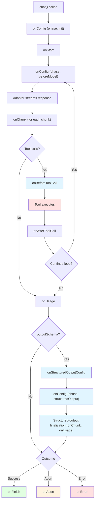

Middleware lets you hook into every stage of the `chat()` lifecycle — from configuration to streaming, tool execution, usage tracking, and completion. You can observe, transform, or short-circuit behavior at each stage without modifying your adapter or tool implementations.

Common use cases include:

- **Logging and observability** — track token usage, tool execution timing, errors
- **Configuration transforms** — inject system prompts, adjust temperature per iteration, filter tools
- **Stream processing** — redact sensitive content, transform chunks, drop unwanted events
- **Tool call interception** — validate arguments, cache results, abort on dangerous calls
- **Side effects** — send analytics, update databases, trigger notifications

## Quick Start

Pass an array of middleware to the `chat()` function:

```typescript
import { chat, type ChatMiddleware } from "@tanstack/ai";
import { openaiText } from "@tanstack/ai-openai";

const logger: ChatMiddleware = {
  name: "logger",
  onStart: (ctx) => {
    console.log(`[${ctx.requestId}] Chat started`);
  },
  onFinish: (ctx, info) => {
    console.log(`[${ctx.requestId}] Finished in ${info.duration}ms`);
  },
};

const stream = chat({
  adapter: openaiText("gpt-4o"),
  messages: [{ role: "user", content: "Hello" }],
  middleware: [logger],
});
```

> **Just want to see chunks flowing through your middleware during development?**
> Use `debug: { middleware: true }` on your `chat()` call — no custom middleware required. See [Debug Logging](./debug-logging).

## Lifecycle Overview

Every `chat()` invocation follows a predictable lifecycle. Middleware hooks fire at specific phases:



### Phase Transitions

The context's `phase` field tracks where you are in the lifecycle:

| Phase | When | Hooks Called |
|-------|------|-------------|
| `init` | Once at startup | `onConfig` |
| `beforeModel` | Before each model call (per iteration) | `onConfig` |
| `modelStream` | While adapter streams chunks | `onChunk`, `onUsage` |
| `beforeTools` | Before tool execution | `onBeforeToolCall` |
| `afterTools` | After tool execution | `onAfterToolCall` |
| `structuredOutput` | During the final structured-output adapter call (when `outputSchema` is set **and** the adapter does not declare `supportsCombinedToolsAndSchema()`). Chunks from `adapter.structuredOutputStream` (or the synthesized non-streaming fallback) flow through `onChunk` with this phase, and `onUsage` fires for the final call's tokens. **Does not fire** for adapters that natively combine tools + schema in one streaming call (modern OpenAI Chat Completions, OpenAI Responses, Claude 4.5+, Gemini 3.x, Grok 4.x family — see issue #605); on that path middleware observes the run through `beforeModel` / `modelStream` as usual. | `onStructuredOutputConfig`, `onConfig`, `onChunk`, `onUsage` |

## Hooks Reference

### onConfig

Called once during `init` (startup) and once per iteration during `beforeModel` (before each model call). When `chat()` was invoked with `outputSchema`, `onConfig` additionally re-fires at the structured-output boundary with `ctx.phase === 'structuredOutput'`, receiving the post-`onStructuredOutputConfig` view of the config — so a single-iteration run with `outputSchema` fires `onConfig` three times (`init` + `beforeModel` + `structuredOutput`). Use it to transform the configuration that the model receives.

Return a **partial** config object with only the fields you want to change — they are shallow-merged with the current config automatically. No need to spread the existing config.

```typescript
const dynamicTemperature: ChatMiddleware = {
  name: "dynamic-temperature",
  onConfig: (ctx, config) => {
    if (ctx.phase === "init") {
      // Add a system prompt at startup — only systemPrompts is overwritten
      return {
        systemPrompts: [
          ...config.systemPrompts,
          "You are a helpful assistant.",
        ],
      };
    }

    if (ctx.phase === "beforeModel" && ctx.iteration > 0) {
      // Increase temperature on retries. Sampling params live in the
      // provider-native modelOptions object — `temperature` is universal,
      // so it's the same key across providers. Spread the existing
      // modelOptions so other model options stay unchanged.
      const current =
        typeof config.modelOptions?.temperature === "number"
          ? config.modelOptions.temperature
          : 0.7;
      return {
        modelOptions: {
          ...config.modelOptions,
          temperature: Math.min(current + 0.1, 1.0),
        },
      };
    }
  },
};
```

> Sampling parameters (`temperature`, `top_p` / `topP`, the various `max*Tokens` keys) live inside `modelOptions` under each provider's native name — they are no longer root config fields. `temperature` happens to be spelled the same across every provider, so the example above is provider-agnostic; if you mutate a token limit instead, use the provider-native key (e.g. `max_output_tokens` for OpenAI, `num_predict` nested under `modelOptions.options` for Ollama). See [Moving Sampling Options into modelOptions](../migration/sampling-options-to-model-options).

**Config fields you can transform:**

| Field | Type | Description |
|-------|------|-------------|
| `messages` | `ModelMessage[]` | Conversation history |
| `systemPrompts` | `string[]` | System prompts |
| `tools` | `Tool[]` | Available tools |
| `metadata` | `Record<string, unknown>` | Request metadata |
| `modelOptions` | `Record<string, unknown>` | Provider-native options — this is where sampling params (`temperature`, `top_p` / `topP`, the provider's `max*Tokens` key) now live, alongside every other model-specific knob. See [Moving Sampling Options into modelOptions](../migration/sampling-options-to-model-options). |

When multiple middleware define `onConfig`, the config is **piped** through them in order — each receives the merged config from the previous middleware.

### onStructuredOutputConfig

Called once at the start of the final structured-output adapter call — only when `chat()` was invoked with `outputSchema` **and** the adapter takes the legacy finalization path (i.e. does not declare `supportsCombinedToolsAndSchema()`). Pipes through middleware in order, like `onConfig`, but with access to the **JSON Schema** being sent to the provider. Use this hook when you need to transform the schema (e.g., inject `$defs`, strip vendor-incompatible keywords) or apply structured-output-specific behavior (e.g., suppress system prompts on the final call).

> Native-combined adapters (modern OpenAI, Claude 4.5+, Gemini 3.x, Grok 4.x — see issue #605) skip the separate finalization call and never invoke this hook. If you need to mutate the schema for a native-combined adapter, do it in `onConfig` (the schema is on `config.modelOptions` / the request — adapter-specific).

Return a **partial** `StructuredOutputMiddlewareConfig` with only the fields you want to change — they are shallow-merged with the current config. Return `void` to pass through.

```typescript
const injectDefs: ChatMiddleware = {
  name: "inject-defs",
  onStructuredOutputConfig: (_ctx, config) => {
    // `config.outputSchema` is the JSON Schema being sent to the provider
    return {
      outputSchema: {
        ...config.outputSchema,
        $defs: { ...sharedDefs },
      },
    };
  },
};
```

**Config fields you can transform:**

| Field | Type | Description |
|-------|------|-------------|
| `messages` | `ModelMessage[]` | Conversation history sent to the final call |
| `systemPrompts` | `SystemPrompt[]` | System prompts on the final call |
| `metadata` | `Record<string, unknown>` | Request metadata |
| `modelOptions` | `Record<string, unknown>` | Provider-native options — this is where sampling params (`temperature`, `top_p` / `topP`, the provider's `max*Tokens` key) now live, alongside every other model-specific knob. See [Moving Sampling Options into modelOptions](../migration/sampling-options-to-model-options). |
| `outputSchema` | `JSONSchema` | JSON Schema being sent to the provider for structured output |

**Ordering at the structured-output boundary:**

1. `onStructuredOutputConfig` fires first, piping through every middleware in array order.
2. `onConfig` then re-fires at the same boundary with `ctx.phase === 'structuredOutput'`, receiving the post-`onStructuredOutputConfig` view of the config (minus `outputSchema`). Use `onConfig` for general-purpose transforms that apply to every adapter call; use `onStructuredOutputConfig` when you need access to the schema.

When multiple middleware define `onStructuredOutputConfig`, the config is **piped** through them in order — each receives the merged config from the previous middleware.

### onStart

Called once after the initial `onConfig` completes. Use it for setup tasks like initializing timers or logging.

```typescript
const timer: ChatMiddleware = {
  name: "timer",
  onStart: (ctx) => {
    console.log(`Request ${ctx.requestId} started at iteration ${ctx.iteration}`);
  },
};
```

### onChunk

Called for every chunk streamed from the adapter. You can observe, transform, expand, or drop chunks.

```typescript
const redactor: ChatMiddleware = {
  name: "redactor",
  onChunk: (ctx, chunk) => {
    if (chunk.type === "TEXT_MESSAGE_CONTENT") {
      // Transform: redact sensitive content
      return {
        ...chunk,
        delta: chunk.delta.replace(/\b\d{3}-\d{2}-\d{4}\b/g, "[REDACTED]"),
      };
    }
    // Return void to pass through unchanged
  },
};
```

**Return values:**

| Return | Effect |
|--------|--------|
| `void` / `undefined` | Chunk passes through unchanged |
| `StreamChunk` | Replaces the original chunk |
| `StreamChunk[]` | Expands into multiple chunks |
| `null` | Drops the chunk entirely |

When multiple middleware define `onChunk`, chunks flow through them in order. If one middleware drops a chunk (returns `null`), subsequent middleware never see it.

#### Chunk types you'll see

`onChunk` receives every [AG-UI event](https://docs.ag-ui.com/introduction) the run produces — not just text. Narrow on `chunk.type` (a discriminated union) before reading type-specific fields. The common ones:

| `chunk.type` | Meaning | Key fields |
|--------------|---------|-----------|
| `RUN_STARTED` / `RUN_FINISHED` / `RUN_ERROR` | Run lifecycle boundaries | `runId`, `finishReason`, `usage` (on finish), `message` (on error) |
| `TEXT_MESSAGE_START` / `TEXT_MESSAGE_CONTENT` / `TEXT_MESSAGE_END` | Assistant text streaming | `messageId`, `delta` (content) |
| `TOOL_CALL_START` / `TOOL_CALL_ARGS` / `TOOL_CALL_END` | Tool invocation streaming | `toolCallId`, `toolCallName`, `delta` (args), result on end |
| `STEP_STARTED` / `STEP_FINISHED` | Thinking / reasoning steps | `delta`, `signature` |
| `STATE_SNAPSHOT` / `STATE_DELTA` | Agent state sync | `snapshot`, `delta` |
| `CUSTOM` | Extensibility events (incl. structured-output — see below) | `name`, `value` |

See the [AG-UI protocol docs](https://docs.ag-ui.com/introduction) for the full event catalogue and exact field shapes.

#### Transforming structured-output chunks

There is **no separate `onStructuredOutputChunk` hook** — and you don't need one. When `chat()` is invoked with `outputSchema`, the structured-output chunks (the JSON `TEXT_MESSAGE_CONTENT` deltas, plus the `structured-output.start` / `structured-output.complete` CUSTOM events and any finalization `RUN_ERROR`) flow through the **same `onChunk` hook** as everything else. You transform, expand, or drop them exactly like any other chunk.

How you distinguish them depends on which finalization path the adapter takes:

- **Separate-finalization adapters** (the legacy path — adapters that don't declare `supportsCombinedToolsAndSchema()`): `ctx.phase === 'structuredOutput'` during the finalization call. Discriminate on the phase.
- **Native-combined adapters** (modern OpenAI Chat Completions / Responses, Claude 4.5+, Gemini 3.x, Grok 4.x — see issue #605): the schema-constrained JSON is produced on the model's natural final turn, so **`ctx.phase` stays `'modelStream'`** — the `'structuredOutput'` phase never fires. Discriminate on the CUSTOM event name (`structured-output.start` / `structured-output.complete`) instead.

```typescript
const redactStructuredOutput: ChatMiddleware = {
  name: "redact-structured-output",
  onChunk: (ctx, chunk) => {
    // Separate-finalization path: the JSON streams as TEXT_MESSAGE_CONTENT
    // during the 'structuredOutput' phase. Transform the delta like any
    // other text chunk — here, redact anything that looks like an SSN before
    // it reaches the client.
    if (
      ctx.phase === "structuredOutput" &&
      chunk.type === "TEXT_MESSAGE_CONTENT"
    ) {
      return {
        ...chunk,
        delta: chunk.delta.replace(/\b\d{3}-\d{2}-\d{4}\b/g, "[REDACTED]"),
      };
    }

    // Both paths: the validated object arrives as a CUSTOM
    // `structured-output.complete` event. On the native-combined path this is
    // your only signal (ctx.phase never flips to 'structuredOutput'), so key
    // off the event name, not the phase. `chunk.value` carries { object, raw }.
    if (chunk.type === "CUSTOM" && chunk.name === "structured-output.complete") {
      console.log("final structured output:", chunk.value);
    }

    // Return void to pass everything else through unchanged.
  },
};
```

> Why is there `onStructuredOutputConfig` but no `onStructuredOutputChunk`? Because the **config** shape genuinely differs at the structured-output boundary — it carries an `outputSchema` field that plain `ChatMiddlewareConfig` doesn't (see [onStructuredOutputConfig](#onstructuredoutputconfig)). **Chunks** are all just `StreamChunk` regardless of phase, so one `onChunk` plus `ctx.phase` (or the CUSTOM event name) covers every case — a parallel chunk hook would be redundant.

### onBeforeToolCall

Called before each tool executes. The first middleware that returns a non-void decision short-circuits — remaining middleware are skipped for that tool call.

```typescript
const guard: ChatMiddleware = {
  name: "guard",
  onBeforeToolCall: (ctx, hookCtx) => {
    // Block dangerous tools
    if (hookCtx.toolName === "deleteDatabase") {
      return { type: "abort", reason: "Dangerous operation blocked" };
    }

    // Validate and transform arguments
    if (hookCtx.toolName === "search" && !hookCtx.args.limit) {
      return {
        type: "transformArgs",
        args: { ...hookCtx.args, limit: 10 },
      };
    }
  },
};
```

**Decision types:**

| Decision | Effect |
|----------|--------|
| `void` / `undefined` | Continue normally, next middleware can decide |
| `{ type: 'transformArgs', args }` | Replace tool arguments before execution |
| `{ type: 'skip', result }` | Skip execution entirely, use provided result |
| `{ type: 'abort', reason? }` | Abort the entire chat run |

The `hookCtx` provides:

| Field | Type | Description |
|-------|------|-------------|
| `toolCall` | `ToolCall` | Raw tool call object |
| `tool` | `Tool \| undefined` | Resolved tool definition |
| `args` | `unknown` | Parsed arguments |
| `toolName` | `string` | Tool name |
| `toolCallId` | `string` | Tool call ID |

### onAfterToolCall

Called after each tool execution (or skip). All middleware run — there is no short-circuiting.

```typescript
const toolLogger: ChatMiddleware = {
  name: "tool-logger",
  onAfterToolCall: (ctx, info) => {
    if (info.ok) {
      console.log(`${info.toolName} completed in ${info.duration}ms`);
    } else {
      console.error(`${info.toolName} failed:`, info.error);
    }
  },
};
```

The `info` object provides:

| Field | Type | Description |
|-------|------|-------------|
| `toolCall` | `ToolCall` | Raw tool call object |
| `tool` | `Tool \| undefined` | Resolved tool definition |
| `toolName` | `string` | Tool name |
| `toolCallId` | `string` | Tool call ID |
| `ok` | `boolean` | Whether execution succeeded |
| `duration` | `number` | Execution time in milliseconds |
| `result` | `unknown` | Result (when `ok` is true) |
| `error` | `unknown` | Error (when `ok` is false) |

### onUsage

Called once per model iteration when the `RUN_FINISHED` chunk includes usage data. Receives the usage object directly.

```typescript
const usageTracker: ChatMiddleware = {
  name: "usage-tracker",
  onUsage: (ctx, usage) => {
    console.log(
      `Iteration ${ctx.iteration}: ${usage.totalTokens} tokens`
    );
  },
};
```

The `usage` object:

| Field | Type | Description |
|-------|------|-------------|
| `promptTokens` | `number` | Input tokens |
| `completionTokens` | `number` | Output tokens |
| `totalTokens` | `number` | Total tokens |

### Terminal Hooks: onFinish, onAbort, onError

Exactly **one** terminal hook fires per `chat()` invocation. They are mutually exclusive:

| Hook | When it fires |
|------|--------------|
| `onFinish` | Run completed normally |
| `onAbort` | Run was aborted (via `ctx.abort()`, an external `AbortSignal`, or a `{ type: 'abort' }` decision from `onBeforeToolCall`) |
| `onError` | An unhandled error occurred |

> **Structured-output lifecycle ordering:** When `chat()` is invoked with `outputSchema`, `onFinish` fires **after** the structured-output finalization call completes — not at the end of the agent loop. `onIteration` does **not** fire for the finalization step; it only fires for agent-loop iterations.
>
> **`onFinish` info fields and structured-output runs:** the `info` object reflects the **agent loop's** terminal state — finalization state is intentionally segregated to keep agent-loop semantics clean.
>
> - `info.content` — the agent loop's accumulated text. Finalization JSON deltas are **not** included here. The structured-output result is delivered via the `structured-output.complete` CUSTOM event, which middleware observes via `onChunk` (with `ctx.phase === 'structuredOutput'`).
> - `info.usage` — the agent loop's last `RUN_FINISHED.usage`. For a tools-less structured-output run (no agent-loop iteration produces `RUN_FINISHED`), this is `undefined`. To capture finalization tokens, use `onUsage` — that hook fires for **every** `RUN_FINISHED` carrying usage, including the finalization call.
> - `info.finishReason` — the agent loop's last `finishReason`. `null` when no agent-loop iteration produced `RUN_FINISHED` (e.g. a tools-less structured-output run).
> - `info.duration` — wall-clock duration of the entire `chat()` invocation, including finalization.
>
> To aggregate usage across the whole run, accumulate from `onUsage` callbacks rather than relying on `info.usage`.

```typescript
const terminal: ChatMiddleware = {
  name: "terminal",
  onFinish: (ctx, info) => {
    console.log(`Finished: ${info.finishReason}, ${info.duration}ms`);
    console.log(`Content: ${info.content}`);
    if (info.usage) {
      console.log(`Tokens: ${info.usage.totalTokens}`);
    }
  },
  onAbort: (ctx, info) => {
    console.log(`Aborted: ${info.reason}, ${info.duration}ms`);
  },
  onError: (ctx, info) => {
    console.error(`Error after ${info.duration}ms:`, info.error);
  },
};
```

The `info` object for `onFinish` (`FinishInfo`):

| Field | Type | Description |
|-------|------|-------------|
| `finishReason` | `string \| null` | The agent loop's last `finishReason`. `null` when no agent-loop iteration produced `RUN_FINISHED` (e.g. a tools-less `chat({ outputSchema })` run). |
| `duration` | `number` | Total run duration in milliseconds, including any structured-output finalization. |
| `content` | `string` | The agent loop's accumulated text content. Does **not** include finalization JSON deltas — for that, observe the `structured-output.complete` CUSTOM event via `onChunk`. |
| `usage` | `{ promptTokens; completionTokens; totalTokens } \| undefined` | **Optional.** The agent loop's last `RUN_FINISHED.usage`. **Does not include finalization tokens** — use `onUsage` to observe those. Always guard with `if (info.usage)` or `info.usage?.`. |

## Context Object

Every hook receives a `ChatMiddlewareContext` as its first argument. It provides request-scoped information and control functions:

| Field | Type | Description |
|-------|------|-------------|
| `requestId` | `string` | Unique ID for this chat request |
| `streamId` | `string` | Unique ID for this stream |
| `threadId` | `string` | AG-UI thread identifier. Resolves to caller-provided `threadId` (or legacy `conversationId`), or an auto-generated value if neither is supplied. Use this for event correlation. |
| `conversationId` | `string \| undefined` | **Deprecated** alias of `threadId`. Always equals `ctx.threadId`; retained so middleware written before the AG-UI rename keeps working. New middleware should read `ctx.threadId`. |
| `phase` | `ChatMiddlewarePhase` | Current lifecycle phase |
| `iteration` | `number` | Agent loop iteration (0-indexed) |
| `chunkIndex` | `number` | Running count of chunks yielded |
| `signal` | `AbortSignal \| undefined` | External abort signal |
| `abort(reason?)` | `function` | Abort the run from within middleware |
| `context` | `TContext` | User-provided runtime context value |
| `defer(promise)` | `function` | Register a non-blocking side-effect |

## Typed Runtime Context

`ChatMiddleware` accepts a context generic. This lets reusable middleware declared outside `chat()` access the same typed runtime context as your tools.

```typescript
import { chat, type ChatMiddleware } from "@tanstack/ai";

type AppContext = {
  userId: string;
  audit: {
    write(event: { userId: string; requestId: string }): Promise<void>;
  };
};

export const auditMiddleware: ChatMiddleware<AppContext> = {
  name: "audit",
  onStart(ctx) {
    ctx.defer(
      ctx.context.audit.write({
        userId: ctx.context.userId,
        requestId: ctx.requestId,
      })
    );
  },
};

chat({
  adapter,
  messages,
  middleware: [auditMiddleware],
  context: {
    userId: session.user.id,
    audit,
  },
});
```

When typed middleware or typed tools are present, `chat()` checks that the provided `context` matches the required shape. Existing middleware typed as plain `ChatMiddleware` still works; its `ctx.context` remains `unknown` and does not force a `context` option.

Runtime context is process-local application state. It is separate from AG-UI `RunAgentInput.context`, which is protocol metadata parsed by `chatParamsFromRequest`. See [Runtime Context](./runtime-context) for server, client, and client-to-server handoff patterns.

### Aborting from Middleware

Call `ctx.abort()` to gracefully stop the run. This triggers the `onAbort` terminal hook:

```typescript
const timeout: ChatMiddleware = {
  name: "timeout",
  onChunk: (ctx) => {
    if (ctx.chunkIndex > 1000) {
      ctx.abort("Too many chunks");
    }
  },
};
```

### Deferred Side Effects

Use `ctx.defer()` to register promises that run after the terminal hook without blocking the stream:

```typescript
const analytics: ChatMiddleware = {
  name: "analytics",
  onFinish: (ctx, info) => {
    ctx.defer(
      fetch("/api/analytics", {
        method: "POST",
        body: JSON.stringify({
          requestId: ctx.requestId,
          duration: info.duration,
          tokens: info.usage?.totalTokens,
        }),
      })
    );
  },
};
```

## Composing Multiple Middleware

Middleware execute in array order. The ordering matters for hooks that pipe or short-circuit:

```typescript
const stream = chat({
  adapter: openaiText("gpt-4o"),
  messages,
  middleware: [authMiddleware, loggingMiddleware, cachingMiddleware],
});
```

### Composition Rules

| Hook | Composition | Effect of Order |
|------|------------|----------------|
| `onConfig` | **Piped** — each receives previous output | Earlier middleware transforms first |
| `onStructuredOutputConfig` | **Piped** — each receives previous output | Earlier middleware transforms first |
| `onStart` | Sequential | All run in order |
| `onChunk` | **Piped** — chunks flow through each middleware | If first drops a chunk, later middleware never see it |
| `onBeforeToolCall` | **First-win** — first non-void decision wins | Earlier middleware has priority |
| `onAfterToolCall` | Sequential | All run in order |
| `onUsage` | Sequential | All run in order |
| `onFinish/onAbort/onError` | Sequential | All run in order |

## Built-in Middleware

TanStack AI ships ready-made middleware for common cases — caching tool results, redacting streamed text, and OpenTelemetry tracing:

| Middleware | Import | What it does |
|------------|--------|--------------|
| `toolCacheMiddleware` | `@tanstack/ai/middlewares` | Cache tool-call results by name + arguments |
| `contentGuardMiddleware` | `@tanstack/ai/middlewares` | Redact / transform / block streamed text content |
| `otelMiddleware` | `@tanstack/ai/middlewares/otel` | Emit OpenTelemetry spans + GenAI metrics |

See [Built-in Middleware](./built-in-middleware) for full options and examples for each. The recipes below show how to build your own.

## Recipes

### Rate Limiting

Limit the number of tool calls per request:

```typescript
function rateLimitMiddleware(maxCalls: number): ChatMiddleware {
  let toolCallCount = 0;
  return {
    name: "rate-limit",
    onBeforeToolCall: (ctx, hookCtx) => {
      toolCallCount++;
      if (toolCallCount > maxCalls) {
        return {
          type: "abort",
          reason: `Rate limit: exceeded ${maxCalls} tool calls`,
        };
      }
    },
  };
}
```

### Audit Trail

Log every action for compliance:

```typescript
const auditTrail: ChatMiddleware = {
  name: "audit-trail",
  onStart: (ctx) => {
    ctx.defer(
      db.auditLog.create({
        requestId: ctx.requestId,
        event: "chat_started",
        timestamp: Date.now(),
      })
    );
  },
  onAfterToolCall: (ctx, info) => {
    ctx.defer(
      db.auditLog.create({
        requestId: ctx.requestId,
        event: "tool_executed",
        toolName: info.toolName,
        success: info.ok,
        duration: info.duration,
        timestamp: Date.now(),
      })
    );
  },
  onFinish: (ctx, info) => {
    ctx.defer(
      db.auditLog.create({
        requestId: ctx.requestId,
        event: "chat_finished",
        duration: info.duration,
        tokens: info.usage?.totalTokens,
        timestamp: Date.now(),
      })
    );
  },
};
```

### Per-Iteration Tool Swapping

Expose different tools at different stages of the agent loop:

```typescript
const toolSwapper: ChatMiddleware = {
  name: "tool-swapper",
  onConfig: (ctx, config) => {
    if (ctx.phase !== "beforeModel") return;

    if (ctx.iteration === 0) {
      // First iteration: only allow search
      return {
        tools: config.tools.filter((t) => t.name === "search"),
      };
    }
    // Later iterations: allow all tools
  },
};
```

### Content Filtering

Drop or transform chunks before they reach the consumer:

```typescript
const contentFilter: ChatMiddleware = {
  name: "content-filter",
  onChunk: (ctx, chunk) => {
    if (chunk.type === "TEXT_MESSAGE_CONTENT") {
      if (containsProfanity(chunk.delta)) {
        // Drop the chunk entirely
        return null;
      }
    }
  },
};
```

### Error Recovery with Retry Logging

```typescript
const errorRecovery: ChatMiddleware = {
  name: "error-recovery",
  onError: (ctx, info) => {
    ctx.defer(
      alertService.send({
        level: "error",
        message: `Chat ${ctx.requestId} failed after ${info.duration}ms`,
        error: String(info.error),
      })
    );
  },
};
```

## TypeScript Types

The core middleware types are exported from `@tanstack/ai`:

```typescript
import type {
  ChatMiddleware,
  ChatMiddlewareContext,
  ChatMiddlewarePhase,
  ChatMiddlewareConfig,
  StructuredOutputMiddlewareConfig,
  ToolCallHookContext,
  BeforeToolCallDecision,
  AfterToolCallInfo,
  IterationInfo,
  ToolPhaseCompleteInfo,
  UsageInfo,
  FinishInfo,
  AbortInfo,
  ErrorInfo,
} from "@tanstack/ai";
```

The option/type surfaces for the [built-in middleware](./built-in-middleware) are exported from the `@tanstack/ai/middlewares` subpath (not the main barrel):

```typescript
import type {
  ToolCacheMiddlewareOptions,
  ToolCacheStorage,
  ToolCacheEntry,
  ContentGuardMiddlewareOptions,
  ContentGuardRule,
  ContentFilteredInfo,
} from "@tanstack/ai/middlewares";
```

## Next Steps

- [Built-in Middleware](./built-in-middleware) — `toolCacheMiddleware`, `contentGuardMiddleware`, `otelMiddleware`
- [OpenTelemetry](./otel) — emit traces and metrics via `otelMiddleware`- [Tools](../tools/tools) — Learn about the isomorphic tool system
- [Agentic Cycle](../chat/agentic-cycle) — Understand the multi-step agent loop
- [Streaming](../chat/streaming) — How streaming works in TanStack AI
